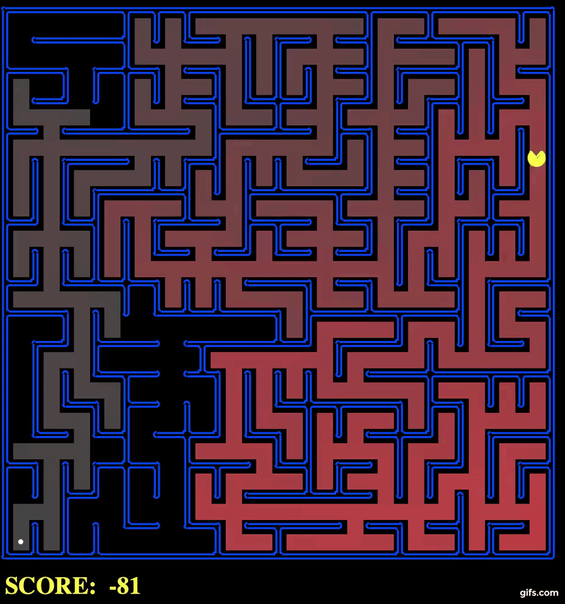

# Artificial-Intelligence
A fun game with Pacman!




## Getting Started

These instructions will get you a copy of the project up and running on your local machine for development and testing purposes. See deployment for notes on how to deploy the project on a live system.

### Prerequisites
Note : It works with python 2.7

search : Includes single-agent path planning with Astar, Breadth first search, Depth First Search and Uniform Cost Search. In this project, the Pacman agent will find paths through his maze world, both to reach a particular location and to collect food efficiently. Built general search algorithms and applied them to Pacman scenarios.

multiagent : In this project, I have designed agents for the classic version of Pacman, including ghosts. Along the way, I have implemented both minimax and expectimax search and tried my hand at evaluation function design.

wumpus: Includes First order logic and proportional logic in the wumpus world.

```
python 2.7
```

### Installing

A step by step series of examples that tell you how to get a development env running

For MAC OS
In terminal:

```
mkdir pacman
cd pacman
git clone https://github.com/gautam-sharma1/Artificial-Intelligence.git
```

End with an example of getting some data out of the system or using it for a little demo

## Running the tests

For search:
In terminal:
```
python pacman.py
python pacman.py --layout testMaze --pacman GoWestAgent
python pacman.py --layout tinyMaze --pacman GoWestAgent
python pacman.py -h
python pacman.py -l tinyMaze -p SearchAgent -a fn=tinyMazeSearch
python pacman.py -l tinyMaze -p SearchAgent
python pacman.py -l mediumMaze -p SearchAgent
python pacman.py -l bigMaze -z .5 -p SearchAgent
python pacman.py -l mediumMaze -p SearchAgent -a fn=bfs
python pacman.py -l bigMaze -p SearchAgent -a fn=bfs -z .5
python eightpuzzle.py
python pacman.py -l mediumMaze -p SearchAgent -a fn=ucs   
python pacman.py -l mediumDottedMaze -p StayEastSearchAgent
python pacman.py -l mediumScaryMaze -p StayWestSearchAgent
python pacman.py -l bigMaze -z .5 -p SearchAgent -a fn=astar,heuristic=manhattanHeuristic 
python pacman.py -l tinyCorners -p SearchAgent -a fn=bfs,prob=CornersProblem
python pacman.py -l mediumCorners -p SearchAgent -a fn=bfs,prob=CornersProblem
python pacman.py -l mediumCorners -p AStarCornersAgent -z 0.5
python pacman.py -l testSearch -p AStarFoodSearchAgent
python pacman.py -l trickySearch -p AStarFoodSearchAgent
python pacman.py -l bigSearch -p ClosestDotSearchAgent -z .5 
python pacman.py -l bigSearch -p ApproximateSearchAgent -z .5 -q 


python pacman.py -l mediumMaze -p SearchAgent -a fn=bds
```


## Built With

* [python](https://www.python.org/download/releases/2.7/) - Used for simulation environment


## Authors

* **Gautam Sharma** - *Initial work* - [Github](https://github.com/gautam-sharma1)


## License

This project is licensed under the MIT License - see the [LICENSE.md](LICENSE.md) file for details

## Acknowledgments

* The projects were developed by John DeNero, Dan Klein, Pieter Abbeel, and many others. 
